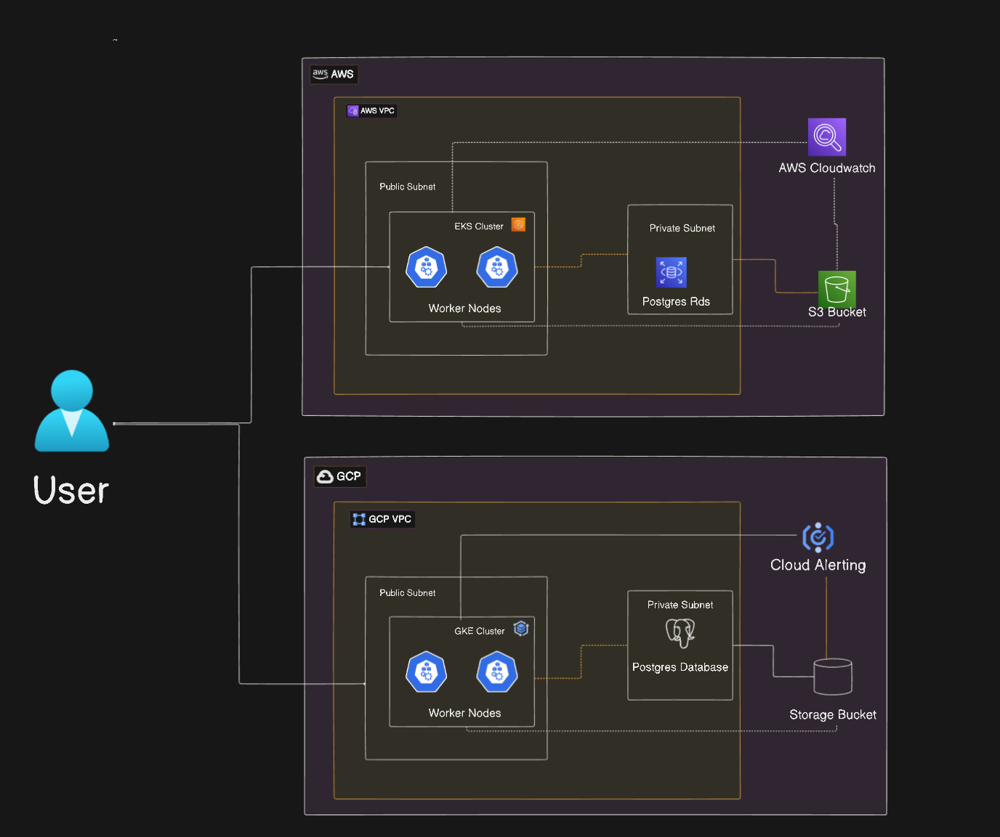

# Multi-Cloud Infrastructure Project

This project implements a production-grade infrastructure across AWS and GCP with automated CI/CD pipelines and comprehensive monitoring.

The High Level Architecture Diagram



## 🏗 Infrastructure Components

### AWS Infrastructure

#### VPC Configuration
- VPC with `/16` CIDR block
- 2 public and 2 private subnets across different availability zones
- Internet Gateway and NAT Gateway for outbound access
- Secure routing tables and network ACLs

#### EKS (Elastic Kubernetes Service)
- Managed Kubernetes cluster with 2 worker nodes
- Auto-scaling enabled for worker nodes
- IAM roles with least privilege access
- Secure pod networking

#### RDS (PostgreSQL)
- PostgreSQL instance in private subnet
- Encryption at rest using AWS KMS
- Automated backups enabled
- Restricted security group access

#### S3 Storage
- S3 bucket for Terraform state
- Versioning enabled
- Server-side encryption
- DynamoDB table for state locking

### GCP Infrastructure

#### VPC Configuration
- VPC with dedicated subnets
- Private Google Access enabled
- Secure firewall rules

#### GKE (Google Kubernetes Engine)
- Managed Kubernetes cluster
- Node auto-scaling
- Private cluster configuration
- Workload Identity enabled

#### Cloud SQL (PostgreSQL)
- PostgreSQL instance in private subnet
- Automated backups
- Encryption enabled
- Private service access

## 🚀 CI/CD Pipeline

The CI/CD pipeline is implemented using GitHub Actions and includes:

### Workflow Triggers
- Push to `main` branch
- Pull requests

### Jobs

1. **Lint & Security Checks**
   - Terraform formatting check
   - Checkov security scanning

2. **AWS Deployment**
   - AWS credentials configuration
   - Terraform plan and apply
   - Infrastructure validation

3. **GCP Deployment**
   - GCP authentication
   - Parallel infrastructure deployment
   - Resource validation

4. **Post-Deployment Tests**
   - Health checks for AWS and GCP endpoints
   - Automated validation
   - Failure notifications

## 📊 Monitoring & Observability

### Metrics Collection (Prometheus)
- 15-second scrape interval
- Service discovery for:
  - Kubernetes nodes
  - AWS EC2 instances
  - GCP Compute instances

### Logging Setup

#### AWS CloudWatch
- Log group: `eks-logs`
- 7-day retention period
- Structured logging

#### GCP Cloud Logging
- Log sink: `gke-logs`
- Cloud Storage bucket integration
- Automated log routing

### Grafana Dashboards
- Multi-cloud infrastructure metrics
- Real-time monitoring panels:
  - CPU Usage
  - Memory Usage
  - Network Traffic
- Auto-refresh every 10 seconds

### Alerting (Prometheus Alertmanager)
- Critical alerts for instance downtime
- Performance threshold alerts
- Cloud-specific alert routing

## 🛠 Setup Instructions

### Prerequisites
- AWS CLI configured
- GCloud SDK installed
- Terraform >= 1.0.0
- kubectl installed
- Helm 3.x

### Infrastructure Deployment

1. Initialize Terraform:
```bash
terraform init
```

2. Create terraform.tfvars file:
```bash
cp terraform.tfvars.example terraform.tfvars
# Edit variables as needed
```

3. Deploy infrastructure:
```bash
terraform apply -var-file=terraform.tfvars
```

### Monitoring Setup

1. Deploy Prometheus stack:
```bash
helm install prometheus prometheus-community/kube-prometheus-stack -f kubernetes/prometheus/values.yaml
```

2. Access Grafana:
```bash
kubectl port-forward svc/prometheus-grafana 3000:80
```

3. Import dashboards from `monitoring/grafana/grafana-dash.json`

## 🔐 Security Features

- IAM roles with least privilege
- Network isolation
- Encryption at rest
- Private subnets for sensitive resources
- Security group restrictions
- Regular security scanning

## 📝 Maintenance

### Backup Strategy
- Automated RDS backups
- Cloud SQL automated backups
- S3 versioning
- State file backups

### Scaling Guidelines
- Node auto-scaling configuration
- Database scaling procedures
- Storage scaling recommendations

