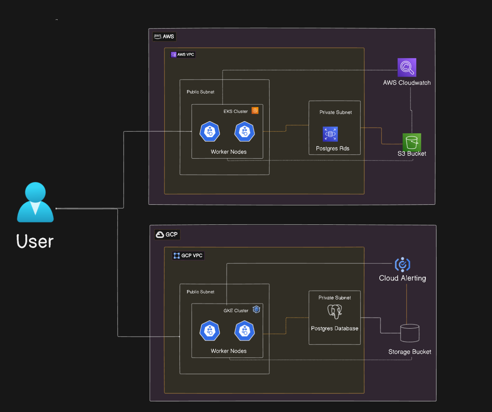

# Multi-Cloud Infrastructure Documentation

This repository implements a production-grade multi-cloud infrastructure across AWS and Google Cloud Platform (GCP). Our infrastructure architecture prioritizes high availability, security, and scalability through strategic deployment of cloud-native services.

## Why This Setup?

Managing a scalable and resilient infrastructure across multiple cloud providers offers several advantages:
- **High Availability**: Redundant systems across AWS and GCP minimize downtime.
- **Cost Optimization**: Leveraging cloud-native services helps reduce operational costs.
- **Vendor Neutrality**: Avoid dependency on a single cloud provider.
- **Performance Optimization**: Deploy workloads in the best-suited environment for efficiency.
- **Security & Compliance**: Multi-layered security approach with encryption and IAM policies.

## Infrastructure Overview

Our AWS infrastructure centers around a Virtual Private Cloud (VPC) with a 10.0.0.0/16 CIDR block, featuring both public and private subnets across multiple availability zones. The network architecture implements NAT Gateways for secure outbound access from private resources while maintaining strict security boundaries. Within this network, we deploy an Elastic Kubernetes Service (EKS) cluster running on t3.medium instances, configured for auto-scaling between 2-4 nodes to handle varying workloads efficiently. For data persistence, we utilize a multi-AZ PostgreSQL RDS deployment with KMS encryption and automated backup systems.

The GCP infrastructure mirrors this robust architecture with a 172.16.0.0/16 VPC implementation. Our Google Kubernetes Engine (GKE) cluster operates on n1-standard-2 machines with similar auto-scaling capabilities. The Cloud SQL instance provides PostgreSQL services with high availability configuration and private IP access, ensuring data security and consistent performance.

### High-Level Architecture Diagram


## Logging and Monitoring Strategy

Our logging architecture implements a comprehensive strategy across both cloud providers. In AWS, we utilize FluentBit DaemonSets within EKS to ship application logs to CloudWatch Logs, while infrastructure logs from VPC Flow Logs, EKS Control Plane, and RDS are automatically collected. CloudWatch provides centralized log analysis through Logs Insights, metrics monitoring, and customizable dashboards.

GCP's logging implementation leverages the Cloud Logging agent for application logs within GKE, automatically capturing and organizing logs by resource and severity. Infrastructure logging covers VPC flows, GKE control plane operations, and Cloud SQL activities. The Cloud Logging and Monitoring suite provides powerful analysis tools, including log-based metrics and error reporting capabilities.

## Security Implementation

Security is implemented through multiple layers across our infrastructure. Network security utilizes private subnets for sensitive resources, with carefully configured security groups and firewall rules controlling access. Data security implements encryption at rest through KMS in both clouds, along with TLS encryption for data in transit. Access control follows the principle of least privilege, using IAM roles and service accounts for precise permission management, while Kubernetes clusters implement RBAC and network policies for workload security.

## 🏗 Infrastructure Components

### AWS Infrastructure

#### VPC Configuration
- VPC with `/16` CIDR block
- 2 public and 2 private subnets across different availability zones
- Internet Gateway and NAT Gateway for outbound access
- Secure routing tables and network ACLs

#### EKS (Elastic Kubernetes Service)
- Managed Kubernetes cluster with 2 worker nodes
- Auto-scaling enabled for worker nodes
- IAM roles with least privilege access
- Secure pod networking

#### RDS (PostgreSQL)
- PostgreSQL instance in private subnet
- Encryption at rest using AWS KMS
- Automated backups enabled
- Restricted security group access

#### S3 Storage
- S3 bucket for Terraform state
- Versioning enabled
- Server-side encryption
- DynamoDB table for state locking

### GCP Infrastructure

#### VPC Configuration
- VPC with dedicated subnets
- Private Google Access enabled
- Secure firewall rules

#### GKE (Google Kubernetes Engine)
- Managed Kubernetes cluster
- Node auto-scaling
- Private cluster configuration
- Workload Identity enabled

#### Cloud SQL (PostgreSQL)
- PostgreSQL instance in private subnet
- Automated backups
- Encryption enabled
- Private service access

## 📊 Monitoring & Observability

### Logging Setup

#### AWS CloudWatch
- Log group: `eks-logs`
- 7-day retention period
- Structured logging

#### GCP Cloud Logging
- Log sink: `gke-logs`
- Cloud Storage bucket integration
- Automated log routing

## 🛠 Setup Instructions

### Prerequisites
- AWS CLI configured
- GCloud SDK installed
- Terraform >= 1.0.0
- kubectl installed
- Helm 3.x

### Infrastructure Deployment

1. Initialize Terraform:
```bash
terraform init
```

2. Create terraform.tfvars file:
```bash
cp terraform.tfvars.example terraform.tfvars
# Edit variables as needed
```

3. Deploy infrastructure:
```bash
terraform apply -var-file=terraform.tfvars
```

### Monitoring Setup

1. Deploy Prometheus stack:
```bash
helm install prometheus prometheus-community/kube-prometheus-stack -f kubernetes/prometheus/values.yaml
```

2. Access Grafana:
```bash
kubectl port-forward svc/prometheus-grafana 3000:80
```

3. Import dashboards from `monitoring/grafana/grafana-dash.json`

## 🔐 Security Features

- IAM roles with least privilege
- Network isolation
- Encryption at rest
- Private subnets for sensitive resources
- Security group restrictions
- Regular security scanning

## 📝 Maintenance

### Backup Strategy
- Automated RDS backups
- Cloud SQL automated backups
- S3 versioning
- State file backups

### Scaling Guidelines
- Node auto-scaling configuration
- Database scaling procedures
- Storage scaling recommendations

